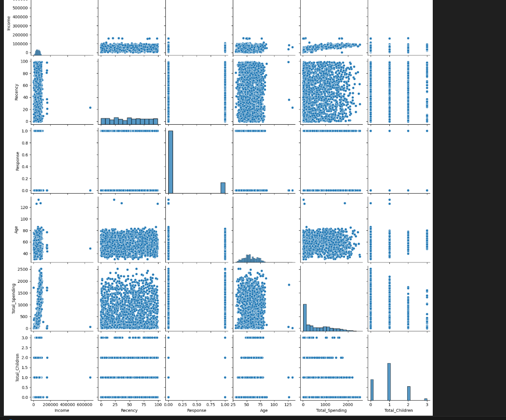
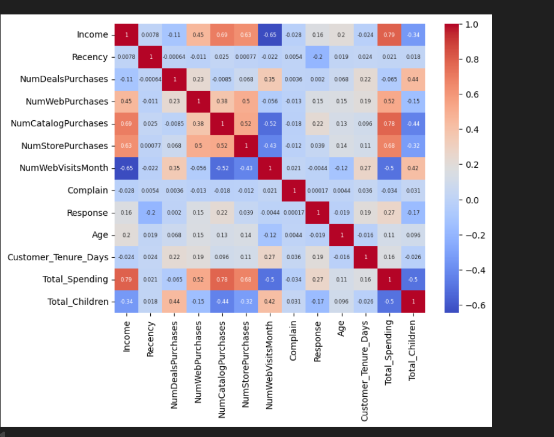
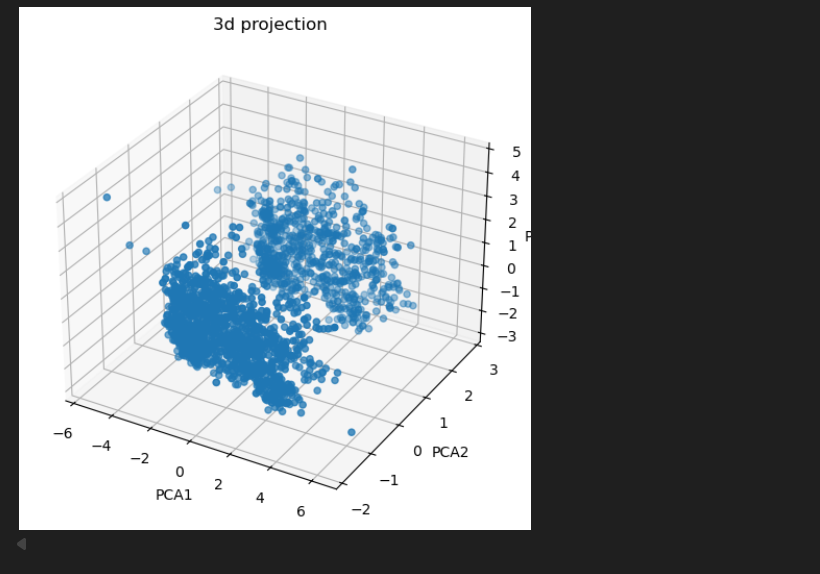
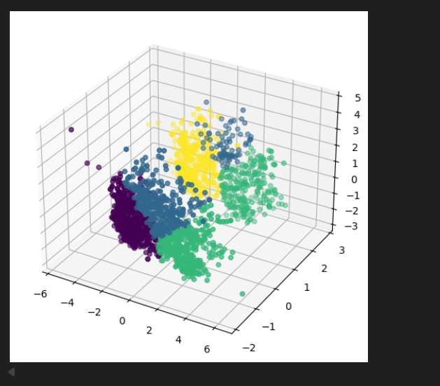

# SmartCart - Customer Analysis Project

## Overview
SmartCart is a comprehensive customer data analysis project that processes and analyzes customer behavior from the SmartCart e-commerce platform. This project uses data preprocessing, feature engineering, and data visualization to gain insights into customer spending patterns and demographics.

## Project Structure
```
SmartCart/
├── smartcart.ipynb              # Main Jupyter notebook with analysis
├── smartcart_customers.csv      # Customer dataset
├── c1.png                       # Visualization 1
├── c2.png                       # Visualization 2
├── c3.png                       # Visualization 3
├── c4.png                       # Visualization 4
├── README.md                    # Project documentation
└── .gitignore                   # Git ignore file
```

## Dataset
- **File**: `smartcart_customers.csv`
- **Description**: Customer data including demographics, purchase history, and engagement metrics

## Key Features
The analysis includes:
- **Data Preprocessing**: Handling missing values, data cleaning
- **Feature Engineering**: 
  - Age calculation based on birth year
  - Customer tenure calculation in days
  - Total spending aggregation across product categories
- **Data Visualization**: Multiple visualizations showing key insights

## Visualizations
The project includes four key visualizations:

### Chart 1 - c1.png


### Chart 2 - c2.png


### Chart 3 - c3.png


### Chart 4 - c4.png


## Technologies Used
- **Python** 3.x
- **Pandas**: Data manipulation and analysis
- **Matplotlib**: Data visualization
- **Seaborn**: Statistical data visualization
- **Jupyter Notebook**: Interactive analysis environment

## How to Use
1. Ensure you have the required dependencies installed:
   ```bash
   pip install pandas matplotlib seaborn jupyter
   ```

2. Open the notebook:
   ```bash
   jupyter notebook smartcart.ipynb
   ```

3. Run the cells sequentially to reproduce the analysis

## Installation
```bash
# Clone the repository
git clone <repository-url>

# Navigate to the project
cd SmartCart

# Install dependencies
pip install pandas matplotlib seaborn jupyter
```

## Project Analysis Steps
1. **Data Loading**: Import customer data from CSV
2. **Exploratory Data Analysis**: Check data shape and missing values
3. **Data Cleaning**: Fill missing income values with median
4. **Feature Engineering**: Create age, tenure, and spending features
5. **Visualization**: Generate insights through charts

## Results & Insights
- Customer age distribution and trends
- Spending patterns across different product categories
- Customer tenure analysis
- Key metrics visualization through graphs c1-c4

## Author
Generated on February 9, 2026

## License
[Add your license information here]

## Contact
[Add contact information if needed]

---

**Note**: This is a customer data analysis project. Ensure all data handling complies with data privacy regulations.
